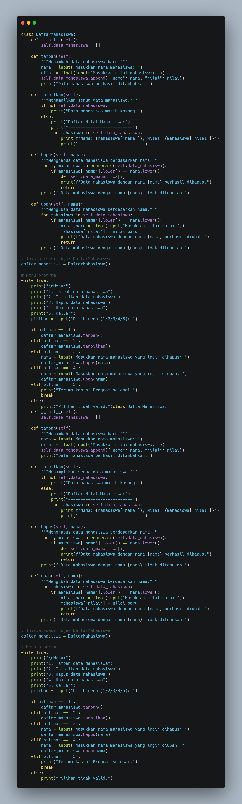
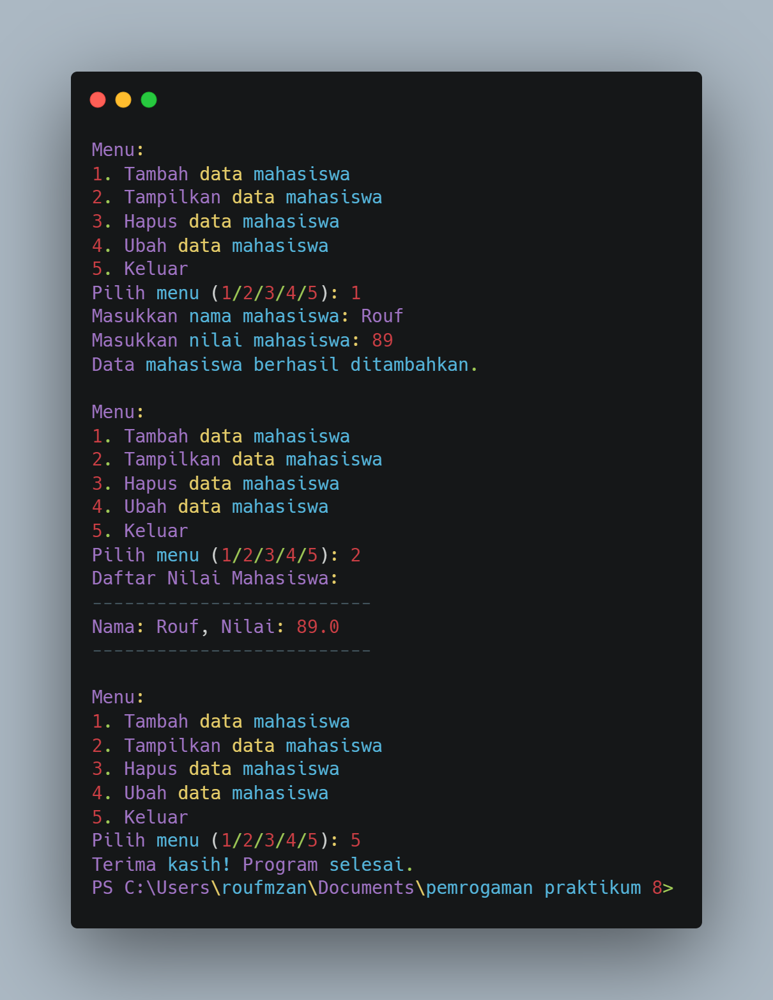

# LAB 8
# DATA DIRI
Nama : RO'UF MUHAMMAD FAUZAN

Kelas : TI.24.A1

NIM : 312410157

# Flowchart, code dan output dari Praktikum 8
## Flowcart

## code

## Output

## Penjelasan
1. Class DaftarMahasiswa:
Class ini menyimpan data mahasiswa dalam bentuk list (data_mahasiswa). Setiap mahasiswa disimpan sebagai dictionary dengan dua kunci: "nama" dan "nilai".

a. Metode __init__(self)
Ini adalah metode konstruktor, yang dijalankan saat objek dari class DaftarMahasiswa dibuat. Di sini, data_mahasiswa diinisialisasi sebagai list kosong untuk menyimpan data mahasiswa.

b. Metode tambah(self)
Metode ini digunakan untuk menambahkan data mahasiswa baru ke dalam data_mahasiswa. Ketika dipanggil, program akan meminta pengguna untuk memasukkan nama dan nilai mahasiswa. Setelah itu, data tersebut disimpan dalam bentuk dictionary ({"nama": nama, "nilai": nilai}) dan ditambahkan ke dalam list data_mahasiswa.

c. Metode tampilkan(self)
Metode ini digunakan untuk menampilkan semua data mahasiswa yang ada dalam data_mahasiswa. Jika list kosong, maka program akan menampilkan pesan bahwa data mahasiswa kosong. Jika ada data, program akan menampilkan setiap nama dan nilai mahasiswa satu per satu.

d. Metode hapus(self, nama)
Metode ini digunakan untuk menghapus data mahasiswa berdasarkan nama. Jika nama yang diberikan ditemukan dalam list, maka data mahasiswa tersebut akan dihapus. Jika nama tidak ditemukan, maka program akan memberi tahu pengguna bahwa data mahasiswa tersebut tidak ada.

e. Metode ubah(self, nama)
Metode ini digunakan untuk mengubah nilai mahasiswa berdasarkan nama. Program akan mencari mahasiswa yang sesuai dengan nama yang diberikan, kemudian meminta pengguna untuk memasukkan nilai baru untuk mahasiswa tersebut. Setelah nilai baru dimasukkan, nilai mahasiswa akan diperbarui.

2. Bagian Program Utama
Pada bagian ini, sebuah objek daftar_mahasiswa dari class DaftarMahasiswa diinisialisasi. Program kemudian memasuki loop while True yang menampilkan menu pilihan untuk pengguna. Menu ini memungkinkan pengguna untuk:

Menambah data mahasiswa
Menampilkan data mahasiswa
Menghapus data mahasiswa
Mengubah data mahasiswa
Keluar dari program
Berdasarkan pilihan yang dimasukkan oleh pengguna, program akan memanggil metode yang sesuai dari objek daftar_mahasiswa. Program terus berjalan dalam loop hingga pengguna memilih untuk keluar (pilihan '5').

3. Detail Menu Program
Pilihan 1 (Tambah data mahasiswa): Memanggil metode tambah() untuk menambahkan data mahasiswa baru.
Pilihan 2 (Tampilkan data mahasiswa): Memanggil metode tampilkan() untuk menampilkan seluruh data mahasiswa.
Pilihan 3 (Hapus data mahasiswa): Meminta pengguna untuk memasukkan nama mahasiswa yang ingin dihapus, lalu memanggil metode hapus(nama).
Pilihan 4 (Ubah data mahasiswa): Meminta pengguna untuk memasukkan nama mahasiswa yang ingin diubah, lalu memanggil metode ubah(nama).
Pilihan 5 (Keluar): Keluar dari program dan menampilkan pesan terima kasih.
4. Validasi Input
Program juga mencakup validasi input, seperti:
Mengonversi input nilai mahasiswa ke dalam tipe data float untuk memastikan bahwa nilai yang dimasukkan adalah angka.
Mengabaikan perbedaan kapitalisasi huruf saat mencocokkan nama mahasiswa (menggunakan .lower()).
5. Penggunaan List dan Dictionary
List (data_mahasiswa) digunakan untuk menyimpan semua data mahasiswa dalam bentuk dictionary.
Dictionary digunakan untuk menyimpan pasangan nama dan nilai untuk setiap mahasiswa.
